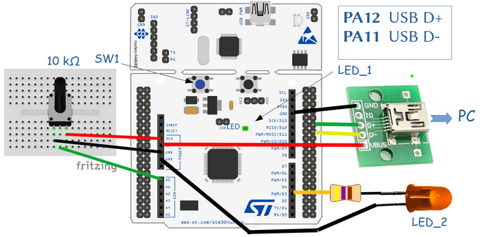
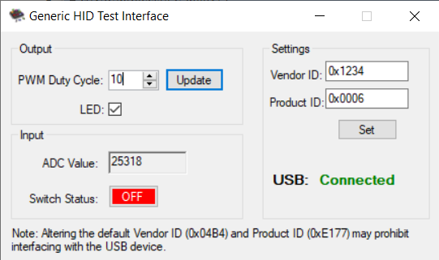
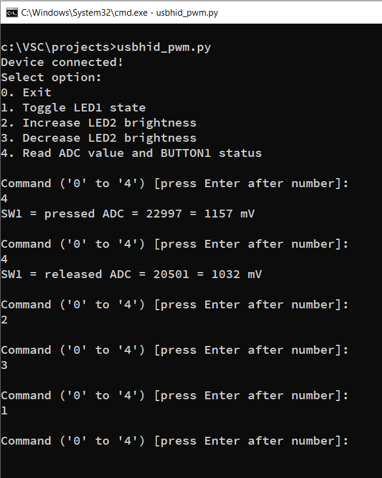

# USB generic HID PWM demo
## project name: mbed6_usbHID_PWM
Tested by: **Keil Studio** 1.50 and **Mbed-OS** 6.16.0

This program implements a general USB HID device, from which the value of the voltage measured 
at the analog input A0 and the status of the user pushbutton can be queried from the PC. 
By sending a specific command, we can control the state of the built-in LED1, as well as
we can control the brightness of LED2 (connected to D3) by PWM.

We are sending and receiving packages of 8 bytes. 
In the case of the packages received from the PC only the first two bytes have meaning:
the firs byte controls the state of LED1 (0: off, 1: on)
the second byte controls the brightness of LED2 (0-100: duty cycle)
The package sent as answer are reports:

first byte: BUTTON1 state (0: released, 1: pressed) 
4th-5th bytes: ADC value in high endian (MSB first) order

The **USBHID** class provides generic HID (Human Interface Device) functionality over the USB channel. 
In the case of generic HID devices, the HID report descriptor specifies 
only specifies the amount of data transferred. The interpretation of the data, however, is left to the firmware 
loaded into the microcontroller and the application running on the PC. In this case, only the method 
of transmission is standard, but the use of the data is unique and manufacturer-specific.
This means, that we need an application on our computer that can manage and understand the USBHID 
data traffic of the unique device we created. It can even be a script, for which we can use the **pywinusb ** 
extension of the Python interpreter. Another option is the [hidapi library](https://github.com/libusb/hidapi), 
which can be used from C/C++ console applications or graphical applications.


## Hardware requirements
* NUCLEO-F446RE development board
* One 10 k potentiometer which divides the 3,3 V power voltage. The slider is connected to A0 (PA_0) analog input.
* USB connector breakout for the STM32F446RE USBFS channel
* USB connection to a PC through the built-in ST-Link v2-1

## Wiring instructions for the NUCLEO-F446RE board

There is no USB connector for the USBFS channel of the target CPU therefore we have to prepare connection
by using an USB cable and an USB socket breakout card.

| USB breakout  | NUCLEO-F446RE pin   |
|:-------:|:-----: |
|  GND    |GND     | 
|  ID     | --     | 
|  D+     | PA_12  |
|  D-     | PA_11  | 
|  VBUS   | 5V     | 





## Software requirements
* Start with an empty mbed 6 project
* Edit the main.cpp source file
* Configure the project by adding an **mbed_app.json** file in which
    * We have to configure **usb_speed** parameter
    * We have to add **USBDEVICE** to the device list of the target

Finally the **mbed_app.json** sholuld look like this: 

```
{
    "config": {
        "usb_speed": {
            "help": "USE_USB_OTG_FS or USE_USB_OTG_HS or USE_USB_HS_IN_FS",
            "value": "USE_USB_OTG_FS"
        }
    },
    "target_overrides": {
        "*": {
            "target.device_has_add": ["USBDEVICE"]
        }
    }
}
```
## mbed6_usbHID_PWM results

### Using with a graphics application 

This simple Generic HID demo is based on the 
example program shown in the Cypress AN82072 Application Note.

Due to the similarities, you can use the graphical PC application
from the published in the downloadable software package of the above 
mentioned Application Note, if you set the Vid/PId valuaes of our device 
(VID = 0x1234, PID = 0x0006). 

Note, that besides the Generic Hid Ui.exe executable, you also need 
the dynamic library cyUSB.dll as well (freom the same ZIP package)



### Using with Python script

Another possibility for testing is the usage of a Python script (besides Python we have to install the **pywinusb** helper module as well)
The following Python script is a console application which provides a simple menu for controlling the USB communication with the mbed card.

```python
from time import sleep
from msvcrt import kbhit

import pywinusb.hid as hid

sw1 = 0
adc = 0
voltage = 0
led1 = 0
led2 = 10

def sample_handler(data):
    global sw1
    global adc
    sw1 = data[1]
    adc = data[4]*256 + data[5]

def send_command(led1,led2):    # Send the message to the Mbed board
    # The first byte is the report ID which must be 0
    buffer = [0 for i in range(9)]  # Array of 9 elements  
    buffer[1] = led1
    buffer[2] = led2
    #-- print(len(buffer),": ", buffer)
    out_report = device.find_output_reports()
    out_report[0].set_raw_data(buffer)
    out_report[0].send()  

all_devices = hid.HidDeviceFilter(vendor_id = 0x1234, product_id = 0x0006).get_devices()

if not all_devices:
    raise ValueError("HID device not found")

device = all_devices[0]
print("Device connected!\r\nSelect option:")
print("0. Exit")
print("1. Toggle LED1 state")
print("2. Increase LED2 brightness")
print("3. Decrease LED2 brightness")
print("4. Read ADC value and BUTTON1 status")

device.open()
# Set custom raw data handler
device.set_raw_data_handler(sample_handler)
while device.is_plugged():
    print("\nCommand ('0' to '4') [press Enter after number]: ")
    while not kbhit() and device.is_plugged():
        index_option = input()
        if index_option.isdigit() and int(index_option) < 5:
            break;
    ix = int(index_option)

    if ix == 0:
        device.close()
        exit()
        pass
    elif ix == 1:
        led1 = not led1
        send_command(led1,led2)
        pass
    elif ix == 2:
        led2 = led2 + 30
        if led2 > 100: led2 = 100
        send_command(led1,led2)
        pass
    elif ix == 3:
        led2 = led2 - 30
        if led2 < 1: led2 = 1
        send_command(led1,led2)
        pass
    elif ix == 4:
        if sw1:
           btn = "pressed"
        else:
           btn = "released"
        voltage = int(adc*3300/65536)
        print("SW1 = {0} ADC = {1} = {2} mV".format(btn,adc,voltage))  
        pass
```


